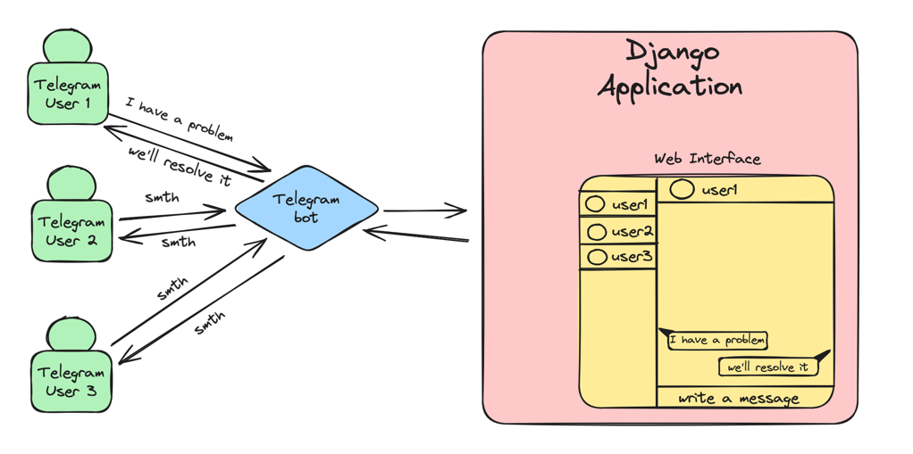

# `TelegramTechSupport `
___

## Description of TTS:
#### Django application that provides to support chat for your projects via Telegram, there's two ways for chat:
- web interface via browser
- web interface via telegram bot (in future)

